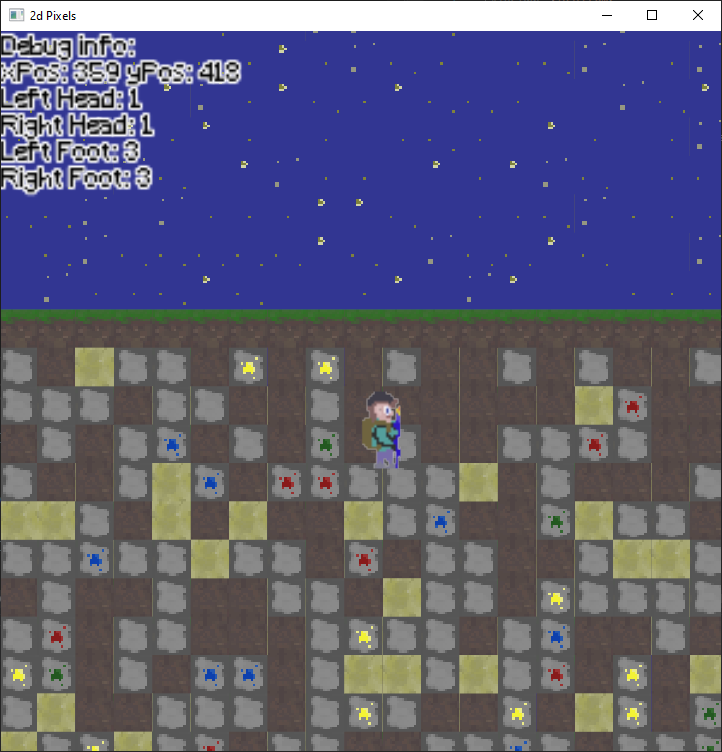
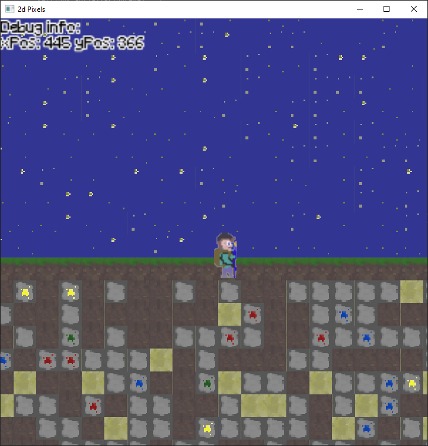

# A Pixel Life

##### Dev Version 2:

I've added the ability to see which blocks the player is overlapping. Numbers in the figure below show the block's enum integer. I've also refactored code into hpp and cpp files. The collision detection is going to be easier than I had previously thought. The 1D vertex aray makes things very simple actually since we know the player's position and the width of each tile.

##### Dev Version 1:

I plan on adding more features to this project, namely collision detection, mining capabilities, and hostile mobs. Collision detection would require me to do some research. I'm not sure if a simple hitbox sensing block collisions around the perimeter of the player is the best strategy or not. If I went with this idea, I'd face some difficulty with map's data structure. It's a 1D vertex array storing block objects, so I'd have to keep track of which index segments the player is within, and check whether their boundaries are permissible.

